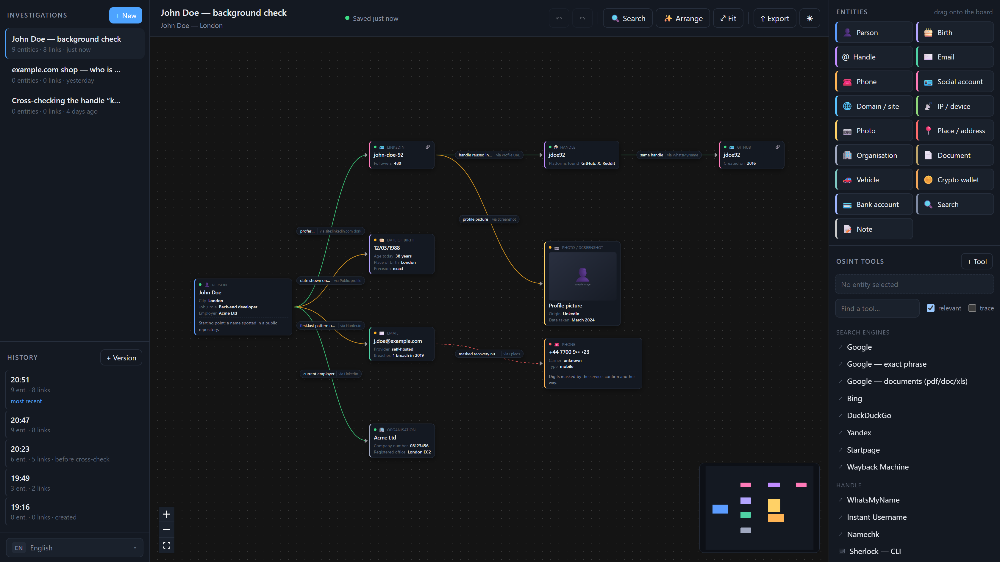
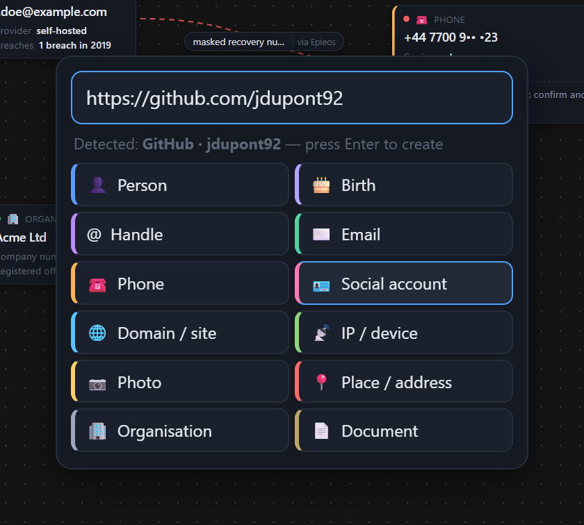
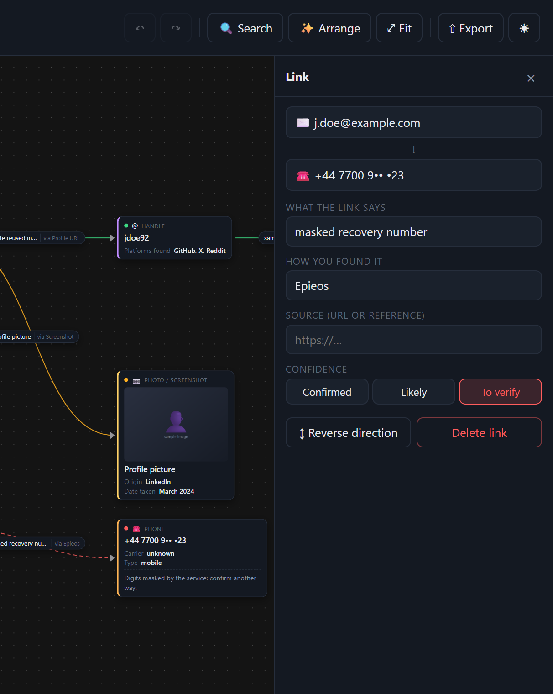
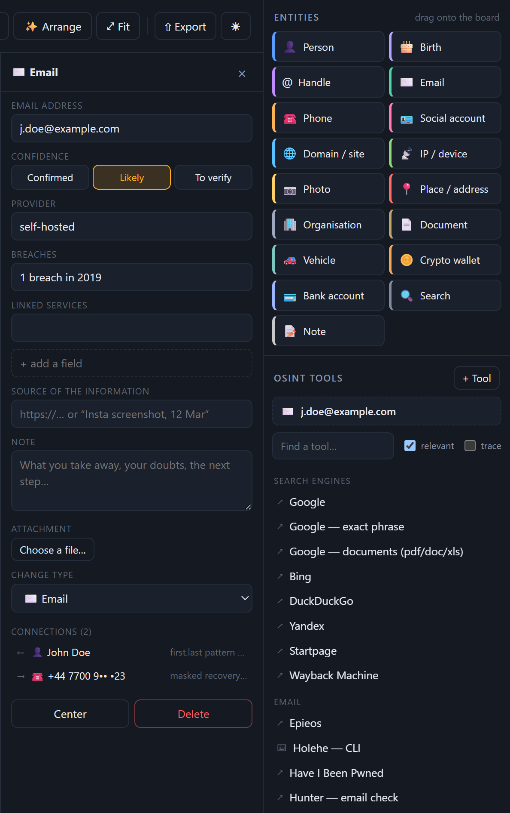
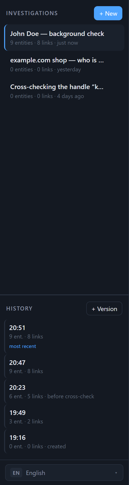
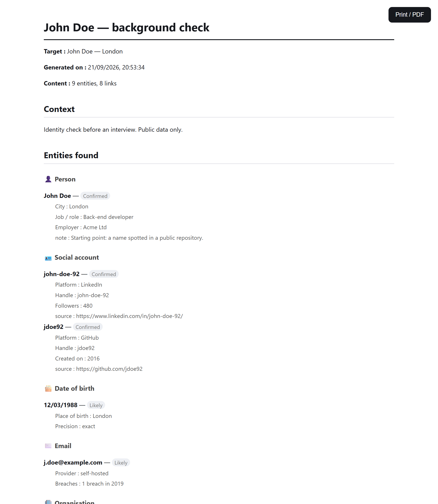
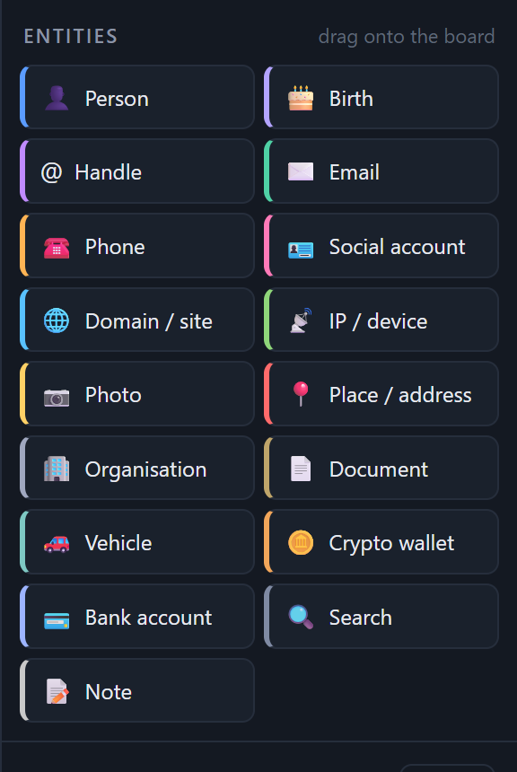
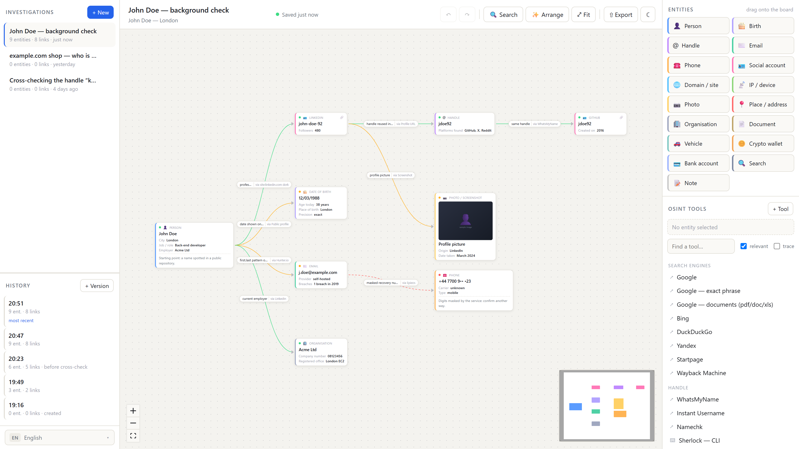

<h1 align="center">osint-canvas</h1>

<p align="center">
  <b>El plano de trabajo de tus investigaciones OSINT, en local.</b><br>
  Coloca lo que encuentras, enlaza cada hallazgo con el anterior,<br>
  y guarda el rastro de <i>cómo</i> llegaste hasta ahí.
</p>

<p align="center">
  <a href="README.md">English</a> ·
  <a href="README.fr.md">Français</a> ·
  <b>Español</b> ·
  <a href="README.pt.md">Português</a> ·
  <a href="README.it.md">Italiano</a> ·
  <a href="README.de.md">Deutsch</a>
</p>

<p align="center">
  = 24">
  
  
  
  
</p>

<p align="center">
  
</p>

> Las capturas de esta página muestran la interfaz en inglés; la aplicación también habla español.

---

## El problema

Una investigación OSINT es una serie de pequeños saltos: un nombre te da un alias, el alias te da
un repositorio de GitHub, el repositorio te da un correo en los commits. Tres días después tienes
veinte pestañas abiertas, un fichero de texto desordenado y ya no recuerdas **de dónde salía** ese
correo — así que ya no sabes si vale algo.

osint-canvas conserva el mapa: cada hallazgo es un elemento y cada flecha dice qué lo une al
anterior y con qué herramienta lo obtuviste.

## Lo que no es

- **No es un recolector.** Sin scraping, sin API, sin peticiones salientes. La aplicación abre los
  sitios OSINT en tu navegador con el valor ya rellenado; el que busca eres tú.
- **No es un servicio.** Sin cuenta, sin nube, sin telemetría.
- **No es una base de inteligencia.** Es un plano de trabajo: pones en él lo que decides poner.

## Empezar

```bash
git clone https://github.com/Cheedy/osint-board.git
cd osint-board
npm install
npm start
```

La aplicación se abre en <http://localhost:5180>. Ninguna dependencia nativa que compilar: la base
la gestiona el módulo `node:sqlite` integrado en Node 24.

---

## Cómo se usa

### 1. Colocar un elemento

**Doble clic** en cualquier sitio del plano, y escribe o pega el valor. El tipo se adivina: correo,
teléfono, fecha de nacimiento, monedero, matrícula, dominio… y los enlaces de perfil se reconocen
por plataforma.

<p align="center"></p>

### 2. Enlazar

**Tira de un hilo** desde el borde de un elemento:

- hacia otro elemento → quedan enlazados. Suelta en cualquier punto de la tarjeta de destino, no
  hace falta apuntar a un punto de 9 píxeles;
- **en el vacío** → la aplicación te propone crear el elemento siguiente, **ya enlazado**. Así se
  sigue una pista sin soltar nunca el ratón.

### 3. Decir cómo lo encontraste

Es el corazón de la herramienta. Una flecha lleva **lo que afirma**, **por qué medio** lo
estableciste y una **fuente**. Tres meses después, vuelves a leer tu propio razonamiento.

<p align="center"></p>

### 4. El atajo que usarás todo el tiempo

Selecciona el elemento del que viene la información y pulsa **`Ctrl+V`**.

¿Encuentras el LinkedIn de tu objetivo? Clic en su nodo, copia la URL del perfil, `Ctrl+V` → un
elemento **LinkedIn · john-doe-92** aparece al lado, **ya enlazado**, con la URL guardada como
fuente pulsable. Se reconocen unas treinta plataformas (LinkedIn, X, Instagram, Facebook, TikTok,
Telegram, Reddit, GitHub, Twitch, Steam, Mastodon, Bluesky, Malt, Leboncoin…).

Funciona igual con un correo, un número, **varias líneas de una vez** (un elemento por línea,
todos enlazados) o una **captura de pantalla** pegada desde el portapapeles.

---

## Lo que hay dentro

### 17 tipos de elementos

Persona · Fecha de nacimiento · Alias · Correo · Teléfono · Cuenta social · Dominio / sitio ·
IP / dispositivo · Foto / captura · Lugar / dirección · Organización · Documento · Vehículo ·
Monedero cripto · Cuenta bancaria · Búsqueda realizada · Nota

Cada tipo tiene sus propios campos, y siempre puedes añadir uno sobre la marcha. Una fecha de
nacimiento muestra la edad de hoy, calculada al vuelo.

### ~75 herramientas OSINT, filtradas por contexto

Selecciona un elemento: la columna de la derecha solo muestra las herramientas que se aplican a su
tipo, y rellena el valor por ti. Buscadores y dorks, alias (WhatsMyName, Sherlock, Maigret),
correo (Epieos, Holehe, HIBP, Hunter), teléfono, redes sociales, búsqueda inversa de imagen,
dominios e infraestructura (crt.sh, urlscan, Shodan, Censys), filtraciones, geo, y una sección
Francia (registro mercantil, Pappers, BODACC, matchID, Geneanet…).

Las herramientas de línea de comandos copian el comando listo para pegar. `+ Herramienta` añade
las tuyas: una URL con `{{value}}` donde va el valor. La casilla **rastrear** deja además un
elemento «Búsqueda» enlazado cada vez que abres una herramienta — tu camino se queda en el plano.

<p align="center"></p>

### Fiabilidad

Cada elemento y cada enlace es **confirmado**, **probable** o **por verificar**, con un código de
color. Los enlaces por verificar van en línea discontinua: de un vistazo ves lo que se sostiene y
lo que solo es una hipótesis.

### Duplicados y cruces

Si un valor ya existe, la aplicación lo avisa y propone fusionar los dos elementos — y te advierte
cuando ese valor aparece en **otra investigación**. `Ctrl+F` busca en el plano actual y en todos
los demás.

### Guardado automático e historial

Todo se guarda un segundo después de tu última acción. El plano se reabre exactamente como lo
dejaste: posiciones, zoom, selección.

Además, cada investigación guarda una **línea de versiones**. Un clic en `20:23` restaura el plano
tal como estaba en ese momento — y el estado actual se fotografía antes de cambiar, así que
restaurar nunca pierde nada.

<p align="center"></p>

### Exportar



- **PNG** del plano, en alta resolución;
- **informe imprimible** (PDF con `Ctrl+P`): elementos agrupados por tipo, enlaces con su método y
  la cronología de la búsqueda;
- **informe en Markdown**;
- **copia de seguridad JSON**, reimportable, para archivar o pasar la investigación a alguien.

<br clear="right">

### Seis idiomas

La interfaz habla **español, inglés, francés, portugués, italiano y alemán** — incluidos los 17
tipos de elementos, sus campos, las categorías de herramientas y los informes exportados. El
selector está abajo en la columna izquierda; en el primer arranque se usa el idioma del navegador,
y luego se recuerda tu elección.

Tus datos nunca se traducen: lo que escribes se queda tal cual.

<p align="center"></p>

### Tema claro

<p align="center"></p>

---

## Atajos

| Gesto | Efecto |
|---|---|
| Doble clic en el plano | Crear un elemento (tipo adivinado, opción «enlazar con») |
| Arrastrar un tipo desde la derecha | Crear un elemento en ese punto |
| Tirar de un hilo desde un elemento | Enlazar, o crear el elemento siguiente ya enlazado |
| Doble clic en el título de un elemento | Renombrar en el sitio |
| `Ctrl+V` | Pegar un hallazgo: tipado y enlazado a la selección |
| `Ctrl+F` | Buscar aquí **y** en las demás investigaciones |
| `Ctrl+Z` / `Ctrl+Y` | Deshacer / rehacer |
| `Ctrl+S` | Fijar una versión en el historial |
| `Supr` | Eliminar la selección |
| `Mayús` + clic | Selección múltiple (2 elementos → Fusionar) |
| `Esc` | Cerrar el panel o la búsqueda |

---

## Dónde están mis datos

```
data/osint.db            investigaciones, enlaces, historial de versiones
data/attachments/<id>/   las capturas pegadas, ordenadas por investigación
```

Un fichero SQLite, nada más. Cópialo, haz copia de seguridad, llévatelo en un USB. `data/` está en
el `.gitignore`: tus investigaciones nunca acabarán en un commit por accidente.

Para trabajar sobre una base separada (demo, pruebas, compartimentar un caso):

```bash
OSINT_DATA_DIR=/ruta/a/carpeta npm run server
```

> Por ahora sin cifrado en reposo. Si tus investigaciones son sensibles, pon `data/` en un volumen
> cifrado (VeraCrypt, BitLocker, LUKS).

## Uso responsable

Esta herramienta sirve para **organizar** información que recogiste en otro sitio. No te exime de
nada: la legalidad de lo que haces depende de qué recoges, sobre quién y para qué.

En Europa, agregar datos públicos sobre una persona física sigue siendo un tratamiento de datos
personales según el RGPD — necesitas una base legal, una finalidad y un plazo de conservación.
Periodismo, investigación académica, seguridad defensiva, due diligence, un test de intrusión
autorizado: perfecto. Acoso, doxxing, vigilar a un particular: no, y no es para eso que existe
este repositorio.

Las capturas de esta página muestran una investigación ficticia.

## Bajo el capó

| | |
|---|---|
| Interfaz | React 18 + TypeScript, [React Flow](https://reactflow.dev) para el lienzo, Zustand |
| Servidor | Express, ~200 líneas, una API REST |
| Base | `node:sqlite` (integrado en Node 24) — **ninguna dependencia nativa** |
| Build | Vite |

```
server/      API REST + esquema SQLite
src/i18n/    los seis diccionarios
src/lib/     tipos de elementos, catálogo de herramientas, detección, exportación, disposición
src/         componentes de la interfaz y almacén de estado
```

El servidor también sirve `dist/` si existe (`npm run build`), para funcionar en un solo puerto.
La arquitectura está lista para empaquetarse como aplicación de escritorio (Electron) sin
reescribir nada.

## Límites conocidos

- Los elementos no se redimensionan a mano.
- Dos pestañas abiertas sobre la misma investigación no se sincronizan en vivo.
- Probado en Windows con Chrome; debería funcionar donde funcione Node 24.

## Contribuir

Las issues y las PR son bienvenidas — en especial nuevas herramientas en `src/lib/tools.ts`,
nuevas plataformas en `src/lib/platforms.ts` y nuevos idiomas.

**Añadir un idioma**: copia `src/i18n/fr.ts`, tradúcelo y decláralo en `src/i18n/langs.ts` y
`src/i18n/current.ts`. El diccionario francés sirve de tipo de referencia, así que
`npx tsc --noEmit` rechaza una traducción a la que le falte una clave — no puedes olvidarte de
ninguna. Ese comando debe pasar antes de abrir una PR.

## Licencia

MIT — ver [LICENSE](LICENSE).
